<div align="center">


<br/>

[](https://python.org)
[](https://tensorflow.org)
[](https://fastapi.tiangolo.com)
[](https://react.dev)
[](https://vitejs.dev)
[](https://opencv.org)

<br/>

> **A full-stack AI medical imaging platform** that automates brain tumor detection, classification, and pixel-level segmentation from MRI scans — with automated clinical PDF reports, QR code sharing, and batch processing, all running from a modern React + FastAPI web application.

<br/>

[](.)
[](.)
[](.)
[](.)

</div>

<br/>

---

## ✨ Features

<table>
<tr>
<td width="50%">

**🧠 AI Detection Pipeline**
- Binary tumor detection — Healthy vs Tumor
- Four-class type classification — Glioma, Meningioma, Pituitary, No Tumor
- U-Net pixel-level segmentation with area estimation
- Confidence scores and probability visualisation

</td>
<td width="50%">

**🖥️ Web Application**
- Drag-and-drop single image & batch analysis
- Automated PDF clinical report generation
- QR code report sharing for mobile access
- Analysis history tracking and dashboard analytics

</td>
</tr>
</table>

---

## 📸 Screenshots

### 🔐 Login Page
| | |
|---|---|
| 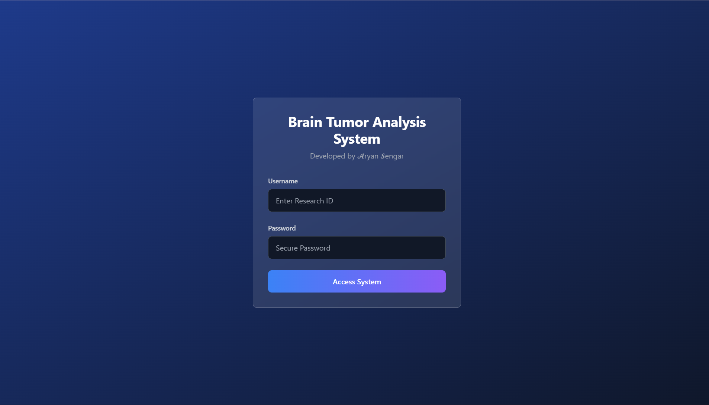 | 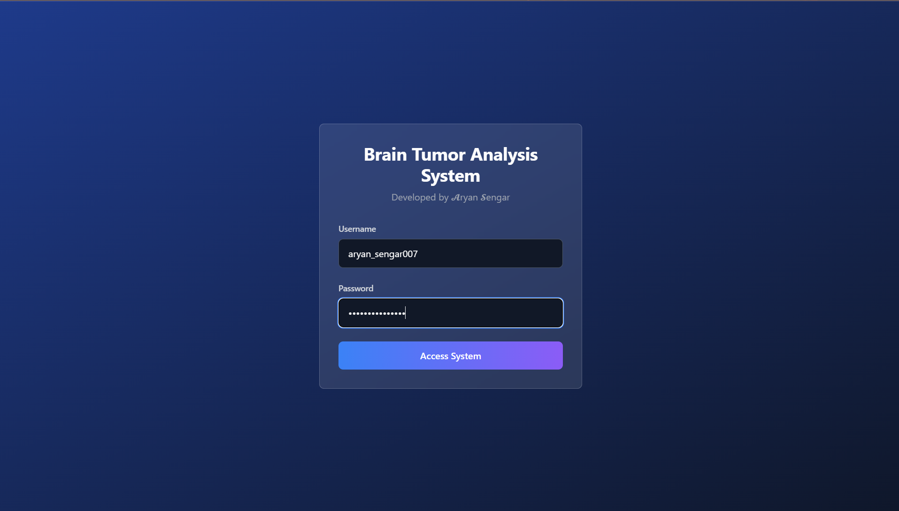 |

### 📊 Dashboard
| | | |
|---|---|---|
|  |  |  |
| 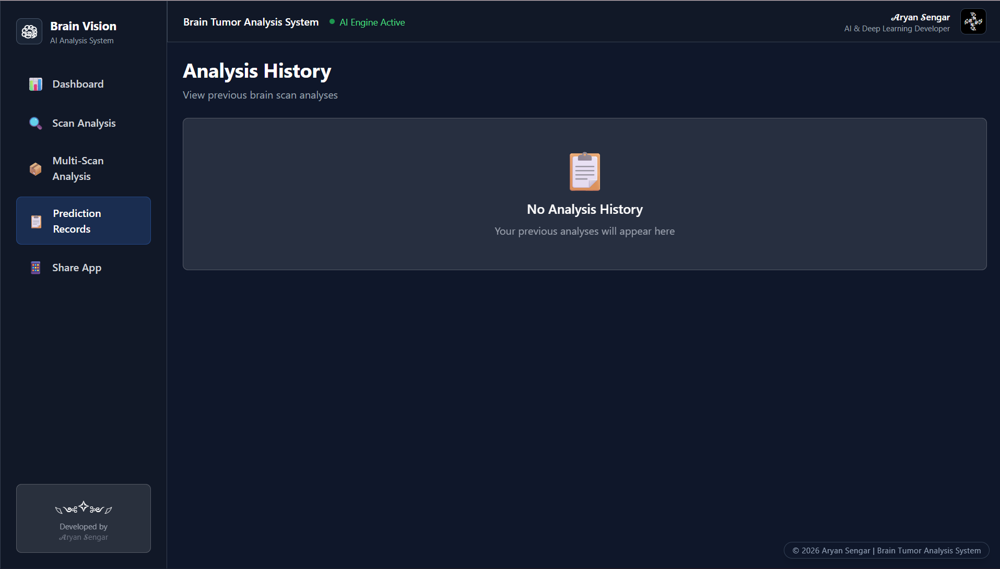 | 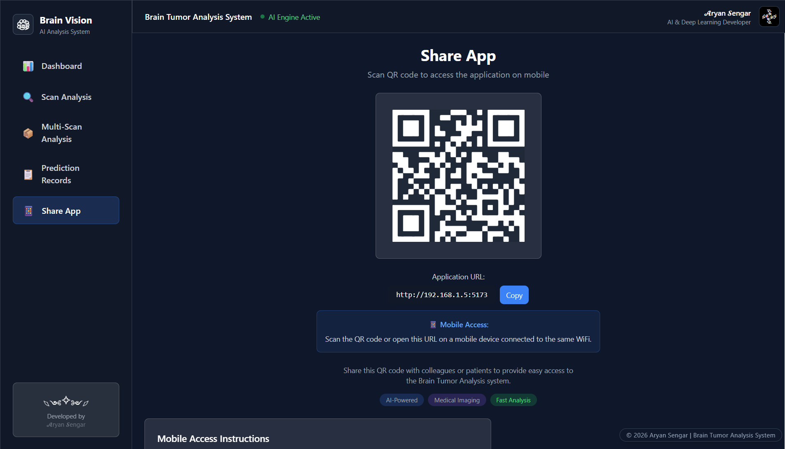 | |

### 🔬 Scan Results
| | | |
|---|---|---|
| 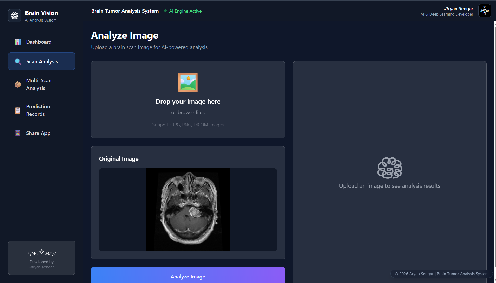 | 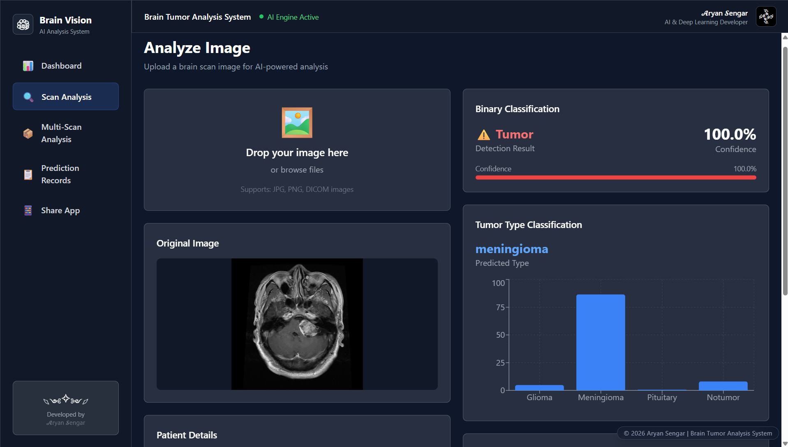 | 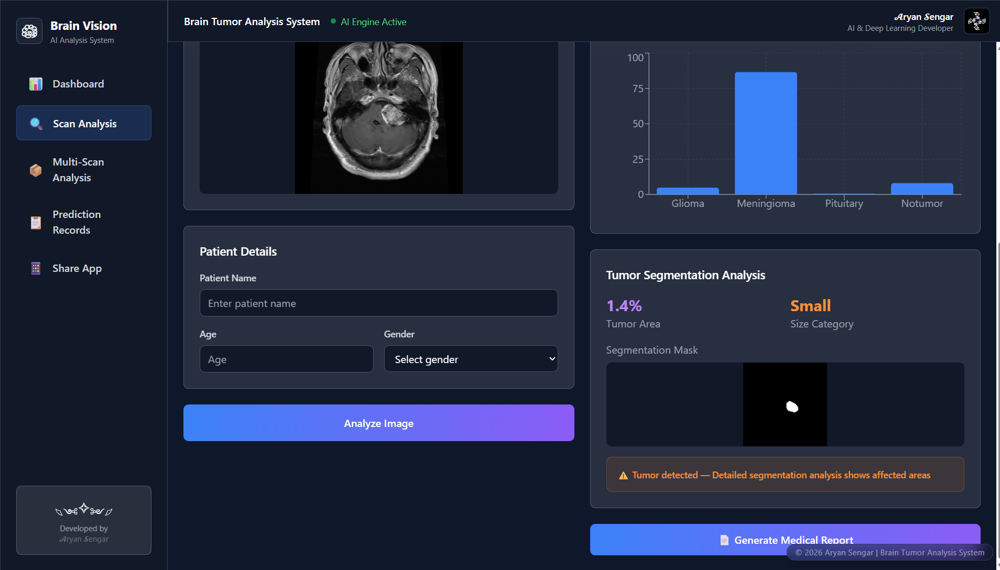 |
| 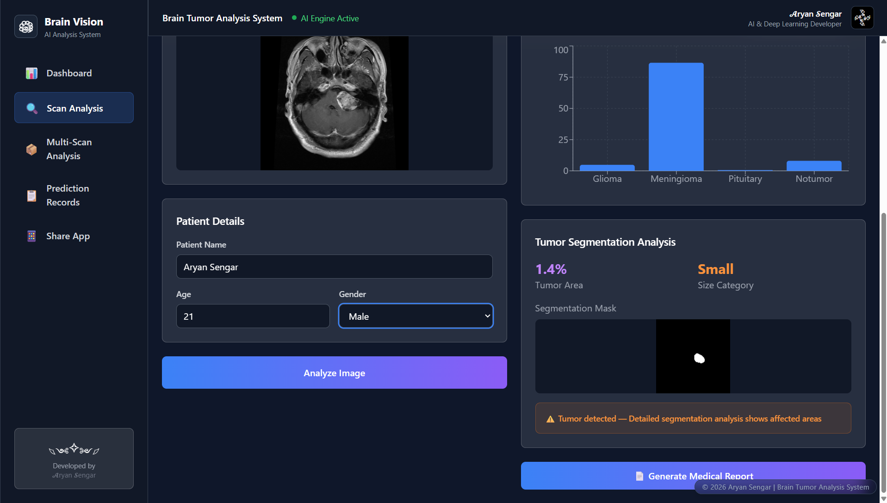 | 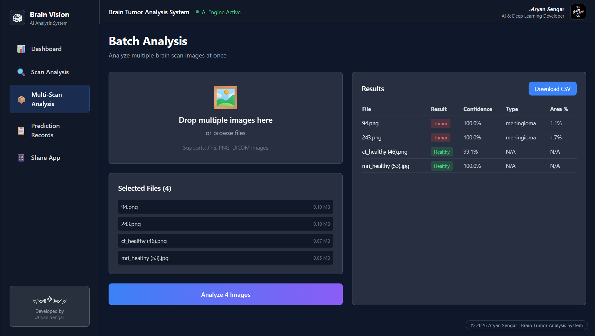 | |

### 📄 Generated Reports
| | | |
|---|---|---|
| 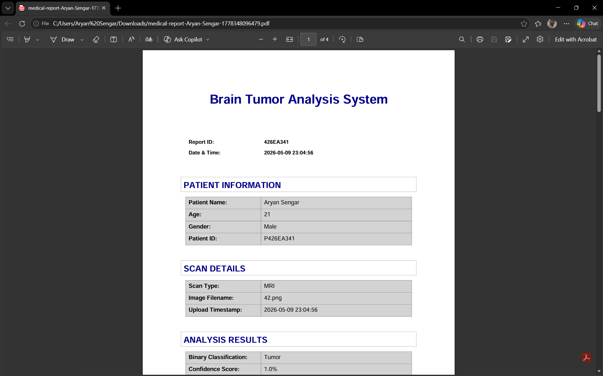 | 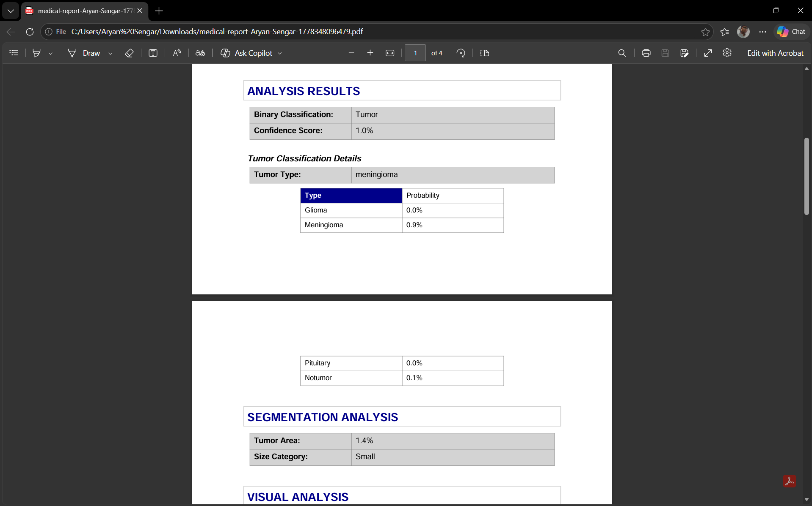 | 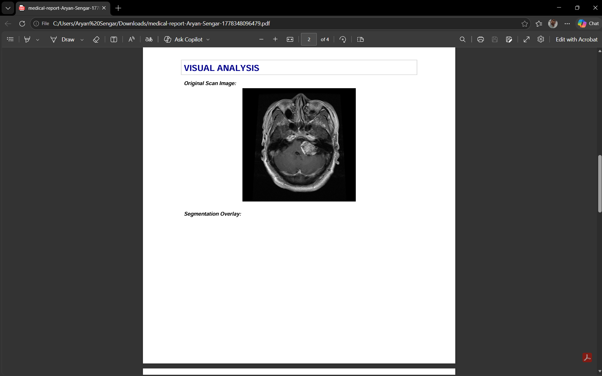 |
| 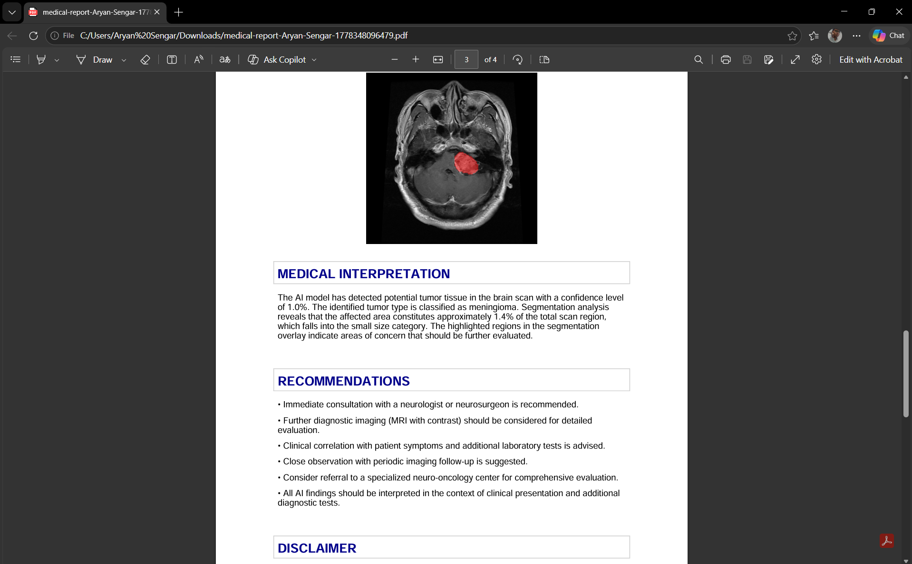 | 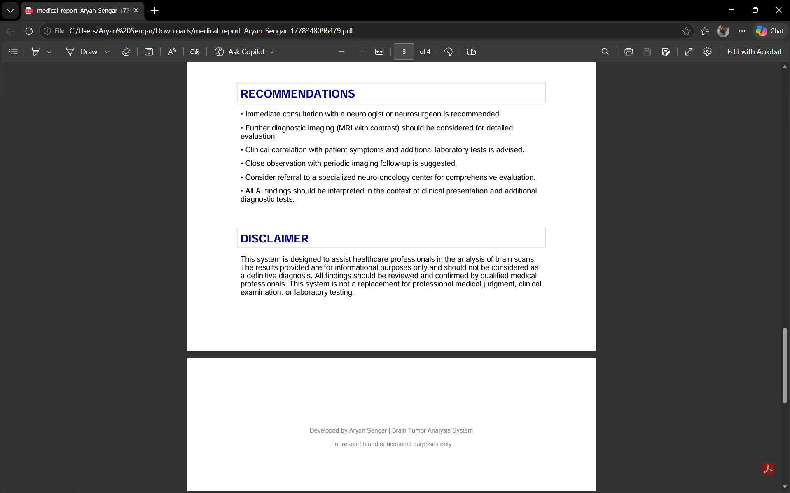 | 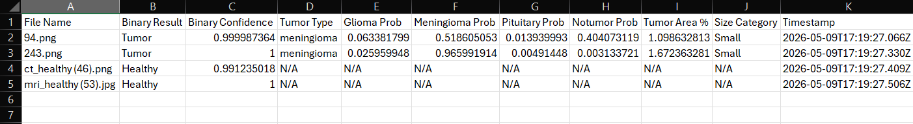 |

---

## 🏗️ System Architecture

```
┌─────────────────────────────────────────────────┐
│             React.js Frontend                   │
│   (Vite · Tailwind CSS · Framer Motion)         │
└────────────────────┬────────────────────────────┘
                     │  HTTP / JSON
                     ▼
┌─────────────────────────────────────────────────┐
│              FastAPI Backend                    │
│   (Uvicorn · Image Preprocessing · ReportLab)  │
└────────────────────┬────────────────────────────┘
                     │  Model Inference
                     ▼
┌─────────────────────────────────────────────────┐
│           TensorFlow Model Layer                │
│                                                 │
│  ┌──────────────┐  ┌──────────────┐  ┌───────┐ │
│  │  CNN Binary  │  │ MobileNetV2  │  │ U-Net │ │
│  │  Classifier  │→ │  Classifier  │→ │ Seg.  │ │
│  └──────────────┘  └──────────────┘  └───────┘ │
└────────────────────┬────────────────────────────┘
                     │
                     ▼
         Prediction + PDF Report + QR Code
```

---

## 🧠 Machine Learning Models

| Model | Task | Architecture | Result |
|-------|------|-------------|--------|
| **Binary Classifier** | Healthy vs Tumor | Custom CNN (128×128 grayscale) | **97.3% Accuracy** |
| **Type Classifier** | Glioma · Meningioma · Pituitary · No Tumor | MobileNetV2 Transfer Learning (224×224 RGB) | **90.0% Accuracy** |
| **Segmentation** | Pixel-level tumor mask | U-Net Encoder-Decoder (128×128) | **Dice Score 0.80+** |

<details>
<summary><b>📐 Model Details</b></summary>

<br/>

**CNN Binary Classifier**
- Optimizer: Adam · Loss: Binary Cross-Entropy
- Epochs: 10 · Batch Size: 433 · Dropout: 0.5
- Callbacks: EarlyStopping + ReduceLROnPlateau

**MobileNetV2 Classifier**
- Pretrained on ImageNet (frozen base) · Fine-tuned classifier head
- Optimizer: Adam · Loss: Categorical Cross-Entropy
- Epochs: 15 · Batch Size: 175 · Dropout: 0.3
- Augmentation: Rotation, Zoom, Flip, Shear

**U-Net Segmentation**
- Encoder-Decoder with skip connections
- Loss: Dice + Binary Cross-Entropy (combined)
- Epochs: 30 · Batch Size: 307
- Regularisation: Batch Normalisation + Dropout

</details>

---

## ⚡ Tech Stack

<table>
<tr>
<th>Frontend</th>
<th>Backend</th>
<th>AI / ML</th>
</tr>
<tr>
<td>

<br/>
<br/>
<br/>
<br/>
<br/>


</td>
<td>

<br/>
<br/>
<br/>
<br/>
<br/>


</td>
<td>

<br/>
<br/>
<br/>
<br/>


</td>
</tr>
</table>

---

## 📂 Project Structure

```
brain-tumor-analysis-system/
│
├── backend/
│   ├── main.py                  # FastAPI application entry point
│   ├── requirements.txt
│   ├── models/
│   │   ├── binary_model.h5      # CNN binary classifier
│   │   ├── type_model.h5        # MobileNetV2 classifier
│   │   └── segmentation_model.h5# U-Net segmentation model
│   └── utils/
│       ├── preprocess.py        # Image preprocessing pipeline
│       └── report.py            # PDF report generation
│
├── frontend/
│   ├── src/
│   │   ├── components/          # DropZone, ResultPanel, Sidebar
│   │   ├── pages/               # Dashboard, History, Batch, Login
│   │   └── App.jsx
│   ├── public/
│   └── package.json
│
├── datasets/
│   ├── binary_dataset/
│   ├── tumor_type_dataset/
│   └── segmentation_dataset/
│
└── assets/                      # README screenshots
```

---

## 🚀 Getting Started

### Prerequisites

- Python 3.10+
- Node.js 18+
- npm 9+

### 1 · Clone the Repository

```bash
git clone https://github.com/aryansengar007/brain-tumor-analysis-system.git
cd brain-tumor-analysis-system
```

### 2 · Start the Backend

```bash
cd backend
pip install -r requirements.txt
python main.py
```

> Backend runs at **`http://localhost:8000`**

### 3 · Start the Frontend

Open a new terminal (`Ctrl + Shift + `` ` `` ` in VS Code), then:

```bash
cd frontend
npm install
npm run dev
```

> Open the localhost link shown in the terminal (typically **`http://localhost:5173`**)

---

## 📡 API Endpoints

| Method | Endpoint | Description |
|--------|----------|-------------|
| `POST` | `/predict/binary` | Tumor vs Healthy detection |
| `POST` | `/predict/type` | Four-class tumor classification |
| `POST` | `/predict/segmentation` | U-Net mask + area estimation |
| `POST` | `/predict/full` | Complete 3-stage pipeline |
| `POST` | `/generate-report` | PDF report generation |
| `GET`  | `/get-local-ip` | Retrieve local server IP for QR linking |

> All endpoints accept `multipart/form-data` image uploads and return structured JSON responses.

---

## 📊 Results & Metrics

<div align="center">

| Metric | Value |
|--------|-------|
| 🎯 Detection Accuracy | **97.3%** (1,924 test samples) |
| 📊 Classification Accuracy | **90.0%** (macro F1 = 0.90) |
| 🔲 Segmentation Dice Score | **0.80+** (Val Dice = 0.8041) |
| 📁 Training Dataset | **~22,946** images across 3 datasets |
| ⚙️ Training Environment | CPU-only (no GPU required) |

</div>

<details>
<summary><b>📈 Per-Class Classification Performance</b></summary>

<br/>

| Class | Precision | Recall | F1-Score |
|-------|-----------|--------|----------|
| Glioma | 0.94 | 0.76 | 0.84 |
| Meningioma | 0.85 | 0.86 | 0.86 |
| Pituitary | 0.88 | **1.00** | 0.94 |
| No Tumor | 0.94 | 0.98 | **0.96** |
| **Macro Avg** | **0.90** | **0.90** | **0.90** |

</details>

---

## 🔮 Future Improvements

- [ ] **Grad-CAM** — Visual saliency maps for explainable AI decisions
- [ ] **DICOM Support** — Native `.dcm` file input for hospital PACS integration
- [ ] **Cloud Deployment** — AWS / GCP with auto-scaling and HTTPS
- [ ] **Mobile App** — Android / iOS for on-the-go MRI analysis
- [ ] **Vision Transformers** — Swin Transformer / ViT model upgrades
- [ ] **Real-Time Inference** — GPU-accelerated sub-second predictions
- [ ] **Multi-User Auth** — Role-based access control for clinical teams
- [ ] **Database Integration** — PostgreSQL for persistent multi-session history

---

## 👨‍💻 Author

<div align="center">

**Aryan Sengar**
B.Tech Computer Science & Engineering

<br/>

[](https://github.com/aryansengar007)
[](https://linkedin.com/in/aryan-sengar-786b96290)

</div>

---

<div align="center">


*If you find this project useful, consider dropping a ⭐ — it helps a lot!*

© 2025 Aryan Sengar · All Rights Reserved

</div>
