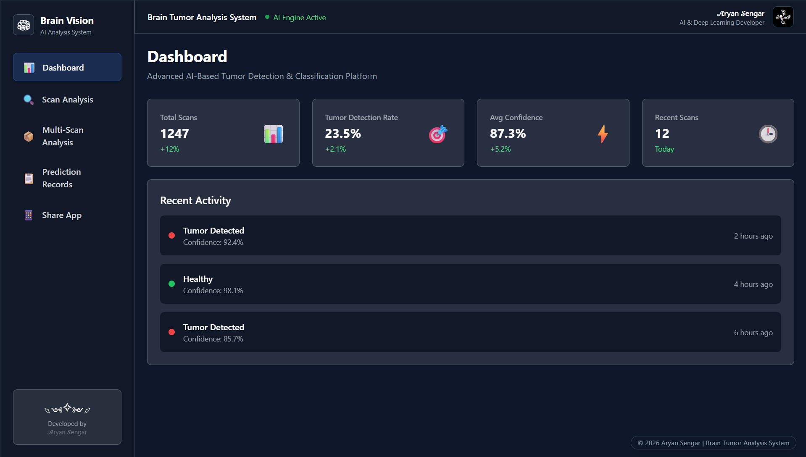
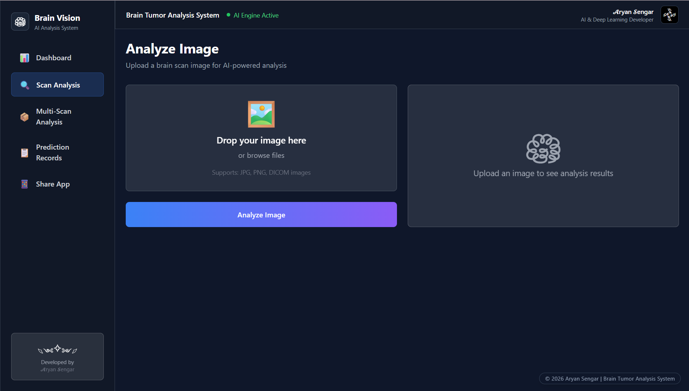
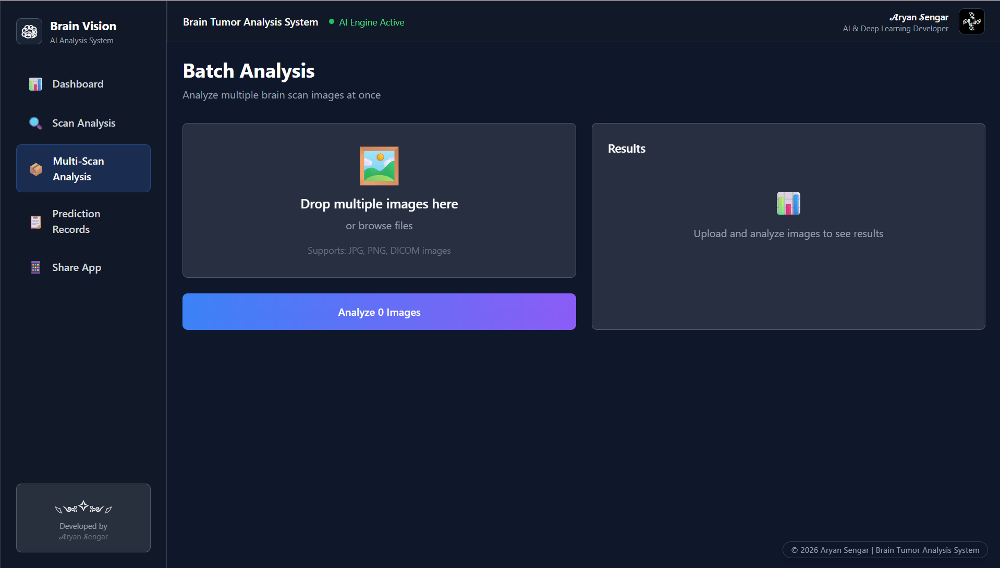

# 🧠 Brain Tumor Analysis System

## AI-Powered Medical Imaging Platform

A professional full-stack AI healthcare platform that performs:

- Brain Tumor Detection
- Tumor Type Classification
- Tumor Segmentation
- PDF Medical Report Generation
- Batch Scan Processing
- QR-Based Mobile Access

Built using React, FastAPI, TensorFlow, and advanced Deep Learning architectures.

---

# ✨ Features

## 🔍 AI Detection Pipeline
- Binary tumor detection (Healthy vs Tumor)
- Multi-class tumor type classification
- Tumor segmentation using U-Net
- Tumor area percentage estimation
- Confidence score analysis
- Probability visualization

## 🖥 Frontend Features
- Modern React dashboard
- Premium responsive UI
- QR-based mobile access
- Login system
- Batch image processing
- Analysis history tracking
- Animated transitions
- Medical report download

## ⚙ Backend Features
- FastAPI REST API
- TensorFlow model inference
- PDF report generation
- Image preprocessing pipeline
- Base64 segmentation output
- Multi-model inference workflow

---

## 🖥️ Demo Screenshots
 
 # Dashboard 
 [](assets/dashboard_1.png)
 [](assets/dashboard_2.png)
 [](assets/dashboard_3.png)

 # Classification Result
 [](assets/prediction_result_1_1.1.png)
 [](assets/prediction_result_1_1.2.png)
 [](assets/prediction_result_1_1.3.png)
 [](assets/prediction_result_1_1.4.png)
 [](assets/prediction_result_1_1.5.png)
 [](assets/prediction_result_1_1.6.png)
 [](assets/prediction_result_1_1.7.png)
 [](assets/prediction_result_2.png)
 [](assets/prediction_result_3.png)

 # Generated File
 [](assets/file_preview_1.1.png)
 [](assets/file_preview_1.2.png)
 [](assets/file_preview_1.3.png)
 [](assets/file_preview_1.4.png)
 [](assets/file_preview_1.5.png)
 [](assets/file_preview_2.png)
 
---

# 🏗 System Architecture

Frontend (React + Tailwind CSS)
↓
FastAPI Backend
↓
TensorFlow Models
├── Binary CNN Classifier
├── MobileNetV2 Classifier
└── U-Net Segmentation Model
↓
Prediction + Report Generation

---

# 🧠 Machine Learning Models

## 1. Binary Classification Model
- Detects Healthy vs Tumor
- Built using CNN
- Accuracy: ~98%

## 2. Tumor Type Classification
Classes:
- Glioma
- Meningioma
- Pituitary
- No Tumor

Model:
- MobileNetV2 Transfer Learning

## 3. Segmentation Model
- U-Net-style architecture
- Generates tumor masks
- Dice Score: ~0.80+

---

# 📂 Dataset Structure

```txt
datasets/
├── binary_dataset/
├── tumor_type_dataset/
└── brats_dataset/
```

Datasets Used:
- MRI Brain Scan Dataset
- CT Scan Dataset
- BraTS Segmentation Dataset

---

# ⚡ Tech Stack

## Frontend
- React
- Vite
- Tailwind CSS
- Framer Motion
- Axios
- Recharts
- React QR Code

## Backend
- FastAPI
- Uvicorn
- TensorFlow
- OpenCV
- Pillow
- ReportLab

## Machine Learning
- TensorFlow / Keras
- MobileNetV2
- U-Net
- scikit-learn
- NumPy
- pandas

---

# 📸 Screenshots Section

Add these screenshots:

- Dashboard
- Login Page
- Single Image Analysis
- Batch Processing
- Segmentation Result
- PDF Report
- QR Code Sharing
- History Page

---

# 🚀 Installation Guide

## 1. Clone Repository

```bash
git clone https://github.com/YOUR_USERNAME/brain-tumor-analysis-system.git
```

---

## 2. Backend Setup

```bash
cd backend
pip install -r requirements.txt
uvicorn main:app --reload
```

Backend URL:

```txt
http://localhost:8000
```

---

## 3. Frontend Setup

```bash
npm install
npm run dev
```

Frontend URL:

```txt
http://localhost:5173
```

---

# 📡 API Endpoints

## Prediction APIs

```txt
POST /predict/binary
POST /predict/type
POST /predict/segmentation
POST /predict/full
```

## Report API

```txt
POST /generate-report
```

## Utility API

```txt
GET /get-local-ip
```

---

# 📊 Evaluation Metrics

## Binary Classification
- Accuracy
- Precision
- Recall
- F1-score
- ROC-AUC

## Segmentation
- Dice Coefficient
- Binary Crossentropy Loss

---

# 🌍 Real-World Applications

- Hospital radiology support
- AI-assisted diagnosis
- Telemedicine platforms
- Medical imaging automation
- Healthcare AI research
- Diagnostic support systems

---

# 🔮 Future Scope

- Cloud deployment
- Official healthcare dashboard
- Real-time camera scanning
- Multi-user authentication
- Improved segmentation models
- Mobile application deployment
- Integration with hospital systems
- Explainable AI visualizations

---
